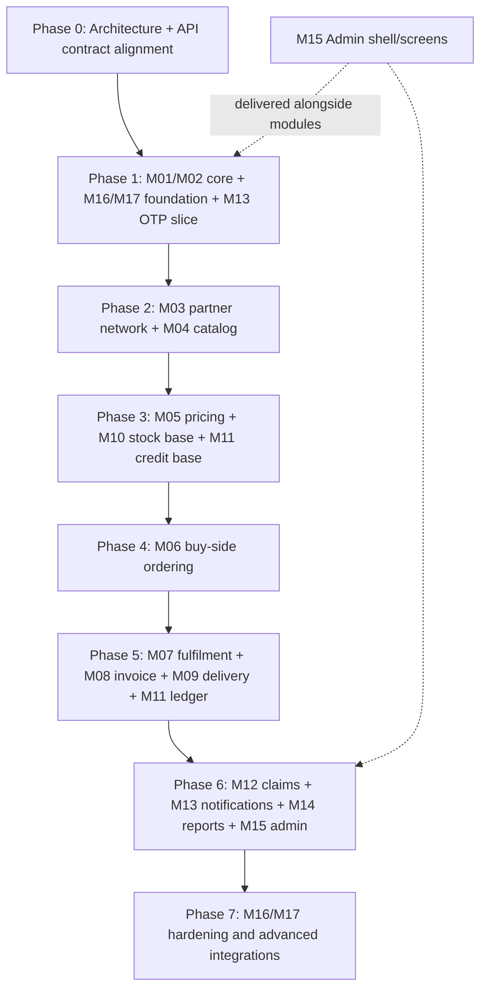

# Agribid Shudh Frontend Implementation Plan

This document is the proposed phased implementation roadmap for the Agribid Shudh frontend. It is a planning document, not a claim that future modules have been implemented. The module specifications are drafts for engineering review.

## Source of Truth and Status

- Product requirements: converted specifications M00–M17 in `Agribid_Shudh_Dev_Specs_by_Module/`.
- Current implementation: repository source code.
- API contracts: `API_Documentation.md` is not present in the inspected workspace. Do not implement API calls until that document is available. The module specs provide endpoint summaries, but not every complete request/response contract.
- `README.md` is intentionally not changed by this plan.

Status markers used below:

- **Implemented:** present in current source code.
- **Partial:** UI or foundation exists, but the specified workflow is not connected end to end.
- **Specified:** present in M00–M17, not found as a completed frontend feature.
- **Decision needed:** requires confirmation from the project lead or API documentation.

## Current Baseline

The repository contains a Next.js 16.3.8 App Router frontend with React 19.2.8, TypeScript 5.9.3, Tailwind CSS 4, and TanStack Query 5.104.1.

- **M00 — Architecture and Common Standards:** foundation is partially implemented: root layout, locale and query providers, API request helper, shared button, admin shell, and dashboard UI.
- **M01 — Authentication and Session:** login and 2FA screens plus an idle-timeout notice are present, but form submissions do not call an API. Token/session lifecycle, route protection, and role loading are not implemented.
- **M02–M17:** specified future work; corresponding feature routes and API use are not present.

Current route files: `app/page.tsx`, `app/admin/login/page.tsx`, and `app/admin/2fa/page.tsx`. TanStack Query is mounted but has no query or mutation consumers. `lib/api-client.ts` wraps native `fetch` but has no current call sites. No middleware, socket client, or auth provider was found.

## Architecture Constraints

1. The specifications describe a Flutter Partner App, an Admin Web Console, and delivery/tracking web views. This repository is the Admin Web Console only.
2. M00 recommends React + TypeScript + Vite for Admin Web but permits equivalent substitutions; M15 also describes SPA hosting. The current repo is Next.js. Confirm the intended web/deployment model before locking in architectural choices.
3. The specified backend is a NestJS modular monolith with APIs and workers. Its entities and services are backend responsibilities, not frontend persistence.
4. The specified actors are partner tiers MF, SS, DS, SD, RT; Admin HQ sub-roles; and DP Delivery Partner. “Buyer” and “seller” are transaction perspectives, not a substitute for roles.
5. API authorization and data scope must be enforced by the backend. Frontend permission-aware navigation is not a security boundary.
6. No frontend WebSocket contract is specified. M00 events and M13 notifications use backend outbox/workers and channels such as in-app, FCM, SMS, and WhatsApp.
7. Module dependencies contain cycles. Implement contracts and vertical slices, not a simplistic numeric M00-to-M17 sequence.

## Dependency-Aware Phases

M00 contains shared standards for all modules. M15 is a continuing Admin workstream delivered alongside module APIs/screens. Phase groupings below follow the M00 sprint plan and module dependency tables, with explicit slices to break cycles.

### Phase 0 — Foundation and Contract Alignment

**Modules:** M00 and existing M01 scaffold.

**Purpose:** Establish the agreed web architecture and shared frontend conventions before feature work.

**Prerequisites:** Review M00/M01; obtain `API_Documentation.md`; confirm Next.js versus SPA deployment choice.

**Work:** Verify route/layout boundaries, API base URL/config, shared error/empty/loading patterns, i18n, query conventions, form approach, and security expectations. Keep existing UI clearly marked as scaffold until APIs work.

**Outcome / definition of done:** Architecture decisions and API contracts are approved; startup/build/lint work; current routes and their incomplete behavior are documented; no speculative endpoint code is introduced.

**Testing:** Existing lint/build scripts; route smoke checks; review configuration and no-secret handling.

### Phase 1 — Identity, Access, Audit, and Integration Foundations

**Modules:** M01, M02 core, M16 audit/config foundation, M17 adapter foundation, M13 OTP-delivery slice. M15 shell/navigation begins alongside this phase.

**Why together:** M01 depends on M02/M03/M13; M02 depends on M01/M16; M16 depends on M01/M02; M13 and M17 depend on M16. This is a cycle, so define the minimal interfaces first: authentication challenge/session, `/me` role data, permission codes, config/secrets boundaries, and notification delivery.

**Prerequisites:** Phase 0 decisions and documented API contracts for login, 2FA, refresh/logout, `/me`, role/permission data, and OTP delivery.

**Frontend work:** Connect Admin email/password + 2FA; implement the documented session lifecycle; build permission-aware navigation and route behavior; add Admin role/user screens; establish audit/config/support entry points as their contracts land. Start M15 shared shell/table/form/filter primitives.

**Outcome / definition of done:** Admin auth works against the real API, expired/invalid sessions behave as specified, role and scope data shape the UI, APIs remain authoritative, and audit/config foundations support later modules.

**Testing:** Login success/failure, 2FA success/failure, expired token/session, disabled/blocked account, permission allow/deny, and role-scoped navigation/API cases.

### Phase 2 — Partner Network and Product Catalog

**Modules:** M03, M04; M17 KYC-verification boundary; M11 credit-account creation interface; M13 partner notifications.

**Why together:** M03 creates partner hierarchy and KYC state; M04 catalog visibility depends on tier/state. M03 approval creates an M11 credit account and uses M13/M17. The M03 dependency summary does not list M11 consistently; confirm this with the project lead.

**Prerequisites:** Phase 1 identity, permission/scope contracts, upload service, KYC integrations, partner-to-credit interface.

**Frontend work:** Partner stepper, draft/resume, document upload, approval queue, profile, hierarchy/remap/block screens; catalog list/search/detail and Admin SKU/category/import workflows.

**Outcome / definition of done:** Partner creation/approval and catalog visibility follow tier/state rules; uploads and approvals show pending/success/error states; generated partner account is available to downstream modules.

**Testing:** Duplicate mobile/GSTIN/PAN, GSTIN/address-state mismatch, approval matrix, remap restrictions, upload type/size, catalog tier/state filters, and SKU validation.

### Phase 3 — Pricing, Inventory, and Credit Primitives

**Modules:** M05, M10 core, M11 credit slice, M16 maker-checker/config.

**Why together:** M06 needs price quotes, stock state, and credit eligibility. M05 depends on M03/M04/M16; M10 depends on M04/M07/M09 in the full lifecycle, but the inventory read/stock-in primitives can precede order reservation. M11 credit accounts/checks are prerequisites for credit checkout.

**Prerequisites:** Phase 2 catalog and partner contracts; approve price/config workflow; backend quote, inventory, and credit APIs.

**Frontend work:** Price-list grid/version compare/approval; quote display; inventory list/add/adjust/history/reorder; credit summary and eligibility states.

**Outcome / definition of done:** UI displays server-resolved prices and stock states; inventory changes have audit reasons; credit availability/hold decisions come from backend.

**Testing:** Effective-date changes, price-change confirmation, maker-checker separation, concurrent stock conflict, no-negative-stock, tier caps, and credit hold.

### Phase 4 — Buy-Side Cart and Ordering

**Modules:** M06, with M04/M05/M10/M11/M13 dependencies.

**Prerequisites:** Catalog, quote, stock and credit APIs; idempotency contract; notification events.

**Frontend work:** Server cart, review/quote, payment method choice, place order, assisted order, purchase list/detail/timeline, cancel/reorder, and changed-price handling.

**Outcome / definition of done:** Buyer can place one valid order; UI handles price changes, MOQ/MOV, stock and credit errors; assisted order exposes confirm/dispute flow.

**Testing:** MOQ/MOV/pack multiples, invalid seller mapping, credit holds, out-of-stock, double submit/idempotency, assisted-order disputes, and online-payment pending expiry.

### Phase 5 — Sell-Side Fulfilment, Invoicing, and Delivery

**Modules:** M07, M08 PDF invoice slice, M09, M10 fulfilment hooks, M11 ledger/payment workflows, M13 events.

**Why together:** M07 acceptance reserves M10 stock; packing triggers M08 invoice and M11 ledger; M09 dispatch/POD updates stock/payment/notifications. Complete this as an order-to-cash vertical slice.

**Prerequisites:** M06 order lifecycle, M10 reservation hooks, invoice API/PDF contract, payment/ledger contracts, M17 required providers.

**Frontend work:** Seller inbox/state transitions/partial acceptance/rejection/pack; invoice preview/download/share; delivery assignment, dispatch, tracking/POD; payment recording and ledger.

**Outcome / definition of done:** A test order progresses from NEW through delivery/closure with correct invoice, stock, ledger, and notifications.

**Testing:** Allowed/invalid transitions, concurrent accept/cancel, capacity, POD OTP/photo flow, partial delivery/returns, invoice numbering/tax, payment allocation and duplicate callbacks. Confirm whether e-way bill is in MVP; M08 calls it phase 2 while M09 may require it for dispatch.

### Phase 6 — Claims, Notifications, Reporting, and Admin Completion

**Modules:** M12, full M13, M14, remaining M15.

**Prerequisites:** Order/delivery/invoice/ledger events and M02 data scopes; M16 config/templates; M17 delivery providers.

**Frontend work:** Claim submission/decision/escalation; notification inbox/preferences/template administration; scoped dashboard/report filters, exports/schedules; remaining Admin views.

**Outcome / definition of done:** Claims resolve to credit note/replacement, notifications obey preferences/quiet hours, reports reconcile and respect hierarchy scope, Admin governs module operations.

**Testing:** Claim window/photo/quantity rules, escalation SLA, notification retry/read/preferences, report scope leakage, export expiry and dashboard freshness.

### Phase 7 — Hardening and Advanced Integrations

**Modules:** M16 completion, M17 phase 2–3 integrations, applicable M01/M09/M13 P2 work.

**Prerequisites:** Core vertical workflows and chosen vendors/contracts.

**Frontend work:** Integration health/retry visibility, advanced payment/GSP/KYC/WhatsApp/ERP workflows, GPS/tracking behavior as specified, production usability/accessibility and failure handling.

**Outcome / definition of done:** QA/UAT, security, performance, integration failure/retry and release criteria are signed off; explicitly defer client-specific Flutter offline work from this web repo.

**Testing:** Vendor sandbox, retry/timeouts, auth/security, performance, UAT and cross-module reconciliation.

## Recommended Implementation Order Diagram

## API Contract Mapping Status

The module specs document endpoint families and selected methods/bodies, but the requested API source `API_Documentation.md` is missing. Therefore, these are **spec-derived endpoint families**, not a verified exhaustive API catalog:

| API domain | Module |
|---|---|
| `/auth/*`, `/admin/auth/*`, `/me`, `/app/config` | M01 |
| `/admin/roles`, `/admin/users`, `/partners/me/staff` | M02 |
| `/partners/*`, `/admin/partners/*`, upload/hierarchy | M03 |
| `/catalog*`, `/admin/skus*` | M04 |
| `/pricing/quote`, `/offers`, `/banners`, `/admin/price-lists*`, `/admin/schemes*` | M05 |
| `/cart`, `/orders*` | M06 |
| `/orders/sales`, accept/reject/pack/override | M07 |
| `/orders/:id/invoice`, `/invoices*` | M08 |
| `/shipments*`, `/deliveries/*`, `/track/:token` | M09 |
| `/inventory*`, `/admin/inventory` | M10 |
| `/payments*`, `/credit/*`, `/ledger*` | M11 |
| `/claims*`, `/orders/:id/claims`, `/admin/claims/*` | M12 |
| `/notifications*`, preferences, templates, provider webhooks | M13 |
| `/dashboard/home`, `/reports/*`, report schedules | M14 |
| Cross-module Admin screens/APIs | M15 |
| `/support/*`, `/admin/audit-logs`, `/admin/config` | M16 |
| Worker-side adapters; frontend endpoint not documented | M17 |

Before implementing any endpoint, verify HTTP method, path, auth, request schema, response schema, error codes, pagination, and idempotency against `API_Documentation.md`.

## Step-by-Step Teaching Workflow

For each phase, proceed one small step at a time and pause before major architectural decisions:

1. Understand the module’s business problem, actors, workflow, rules, and dependencies.
2. Read the API contract and map request/response/errors to the workflow.
3. Trace existing project architecture and decide where types/data access/UI belong.
4. Implement the smallest vertical slice: types/API function, then query or mutation if server state is involved, then page/components/form/states/permissions.
5. Validate manually and with available lint/build/tests; cover failure and permission cases.
6. Explain the change, data/API flow, tradeoffs, and how to describe it to a senior developer.

Do not begin a later phase until the user explicitly requests it. Never invent missing APIs; report them as **API not currently documented**.

## Phase Completion Checklist

- [ ] Specification and dependencies understood.
- [ ] API contract verified.
- [ ] Types and API layer implemented where needed.
- [ ] Query/mutation and cache behavior explained and tested where needed.
- [ ] Routes, components, forms, validation and permission behavior implemented.
- [ ] Loading, error, empty, success and applicable offline states handled.
- [ ] Required notification/realtime behavior implemented only when specified.
- [ ] Main workflow and edge cases tested; Definition of Done satisfied.
- [ ] Developer can explain the architecture and decisions.