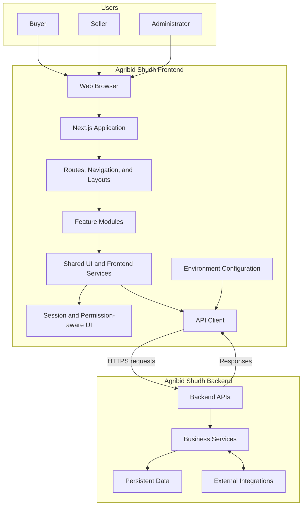

# Agribid Shudh — Frontend

The frontend application for Agribid Shudh. The backend is maintained separately.

## Related Repository

[agribid-shudh-backend](https://github.com/vivek-9941/agribid-shudh-backend)

Refer to the backend repository for API documentation and backend setup.

## Getting Started

### Prerequisites

- Node.js
- npm

### Install dependencies

```bash
npm install
```

### Run locally

```bash
npm run dev
```

Open the local URL shown in the terminal. Run `npm run` to see the scripts available in `package.json`.

## High-Level Design

The diagram illustrates a proposed frontend architecture. Backend internals and API contracts should be confirmed against the backend documentation.



### Architecture Principles

- Organize frontend code by product feature, with shared components and services kept reusable.
- Adapt screens and actions to user roles; the backend must enforce authorization.
- Treat the backend as the source of truth for business rules and persistent data.
- Handle loading, empty, and error states consistently.
- Keep secrets out of source control and configure environment-specific values outside the code.

## Product Modules

The following module names are based on the development-spec filenames provided. Listing a module does not imply it is implemented.

| ID | Module |
|---|---|
| M00 | Architecture and Common Standards |
| M01 | Authentication and Session |
| M02 | Users, Roles, and Permissions (RBAC) |
| M03 | Partner Hierarchy and KYC Onboarding |
| M04 | Product Catalog |
| M05 | Pricing and Schemes |
| M06 | Cart and Ordering (Buy Side) |
| M07 | Order Fulfilment (Sell Side) |
| M08 | Invoicing and GST Compliance |
| M09 | Dispatch and Delivery |
| M10 | Inventory |
| M11 | Payments, Credit, and Ledger |
| M12 | Returns and Claims |
| M13 | Notifications |
| M14 | Dashboards and Reports |
| M15 | Admin Console |
| M16 | Audit, Configuration, and Support |
| M17 | Integrations Hub |

## Proposed Sprint Plan

This is an initial grouping by module. Confirm dependencies, team capacity, and acceptance criteria against the detailed specifications before scheduling.

| Sprint | Focus | Modules |
|---|---|---|
| 0 | Architecture and project foundations | M00 |
| 1 | Authentication and access control | M01, M02 |
| 2 | Partner onboarding | M03 |
| 3 | Catalog, pricing, and schemes | M04, M05 |
| 4 | Buyer ordering | M06 |
| 5 | Fulfilment, dispatch, and inventory | M07, M09, M10 |
| 6 | Invoicing and financial workflows | M08, M11 |
| 7 | Returns and notifications | M12, M13 |
| 8 | Reporting, administration, and integrations | M14, M15, M16, M17 |

## Configuration and Security

- Follow the backend documentation for API URLs, authentication, and required configuration.
- Do not commit credentials, tokens, or secrets.
- Frontend validation supports usability; the backend must enforce business rules and permissions.