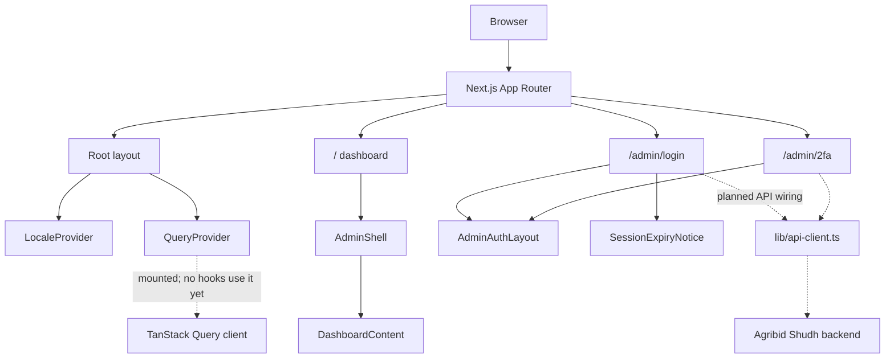
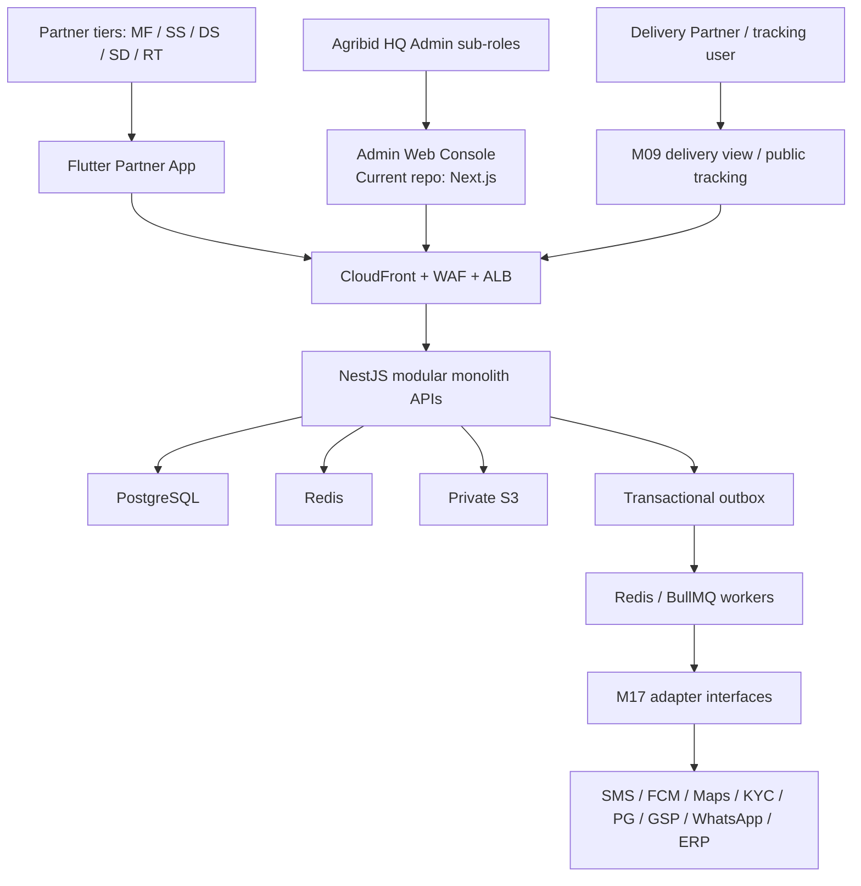
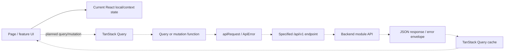
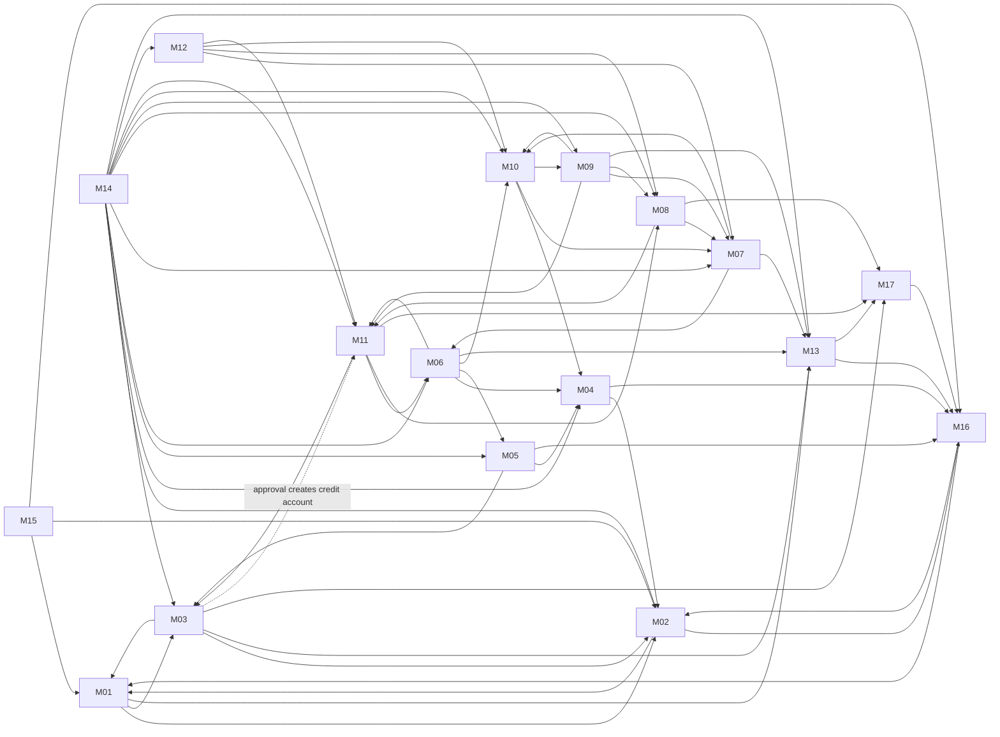

# Agribid Shudh — Frontend

This repository contains the Agribid Shudh **Admin Web Console**. The product specifications also define a Flutter Partner App and limited delivery/tracking web views; those clients are not part of this repository.

The backend is maintained separately: [agribid-shudh-backend](https://github.com/vivek-9941/agribid-shudh-backend).

> **Implementation status:** The frontend currently has the M00 foundation and M01 authentication UI scaffolding. Login, 2FA, API integration, session handling, and route protection are not yet connected end to end. M02–M17 are specified future modules, not implemented features. See [Current Implementation](#current-implementation).

## Getting Started

### Prerequisites

- Node.js
- npm

### Install and run

```bash
npm install
npm run dev
```

Open the local URL printed by Next.js. Run `npm run` to see available scripts. `npm run lint` and `npm run build` are also defined in `package.json`.

Configure `NEXT_PUBLIC_API_BASE_URL` when connecting to an API environment. Do not place secrets in `NEXT_PUBLIC_*` variables or commit credentials.

## Current Implementation

| Area | Current state |
|---|---|
| M00 foundation | Root layout, locale and query providers, shared button, API request helper, admin shell, and dashboard UI are present. |
| M01 authentication | Admin email/password and 2FA screens plus an idle-timeout notice are present as UI only. Form submission does not call an API. |
| Routes | `/`, `/admin/login`, and `/admin/2fa`. No middleware or protected-route guard was found. |
| Server data | TanStack Query is installed and its provider is mounted; no queries or mutations currently use it. |
| API | `lib/api-client.ts` provides a native `fetch` wrapper; current UI has no API call sites. |
| M02–M17 | Specified for future implementation; corresponding feature routes and API usage are not present. |

The module specifications are drafts for engineering review. A screen marked as designed in a spec does not mean it has been implemented.

## Technology Stack

| Technology | Version / use |
|---|---|
| Next.js | 16.3.8, App Router |
| React / React DOM | 19.2.8 |
| TypeScript | 5.9.3; strict mode enabled |
| TanStack Query | 5.104.1; provider present, no query/mutation usage yet |
| Styling | Tailwind CSS 4, `tw-animate-css`, shadcn Tailwind styles |
| UI | Base UI React, class-variance-authority, Lucide icons |
| Motion | `motion` 14; used for the login entrance transition |

M00 recommends React + TypeScript + Vite for the Admin Web Console and allows equivalent substitutions. M15 also describes an SPA deployment, while this repository uses Next.js. Confirm the intended web build/deployment model with engineering before treating that difference as settled.

## Repository Structure

```text
app/                         App Router pages and global styles
  admin/login/               Admin login UI
  admin/2fa/                 Admin 2FA UI
components/auth/             Shared authentication layouts/notices
components/dashboard/        Dashboard UI
components/layout/            Admin shell and locale switcher
components/providers/         Locale and TanStack Query providers
components/ui/                Shared UI primitives
lib/                          API helper, messages, utilities
public/                       Static assets
docs/                         Frontend overview HTML/PDF
Agribid_Shudh_Dev_Specs_by_Module/  Converted M00–M17 specifications
```

## Product Actors and Clients

The specifications identify these actors; “buyer” and “seller” describe a partner’s role in a transaction and are not substitutes for the account/permission model.

| Actor | Specified client / context |
|---|---|
| MF | Agribid Manufacturer; web and mobile |
| SS | State Stockist; primarily mobile, optional web |
| DS | Distributor; primarily mobile |
| SD | Sub-Distributor; primarily mobile |
| RT | Retailer; primarily mobile, can self-register via referral |
| ADM | Agribid HQ Admin with sub-roles; Admin Web Console |
| DP | Delivery Partner; light role with delivery web view/mobile P2 |

M02 specifies roles such as `MF_OWNER`, `SS_OWNER`, `DS_OWNER`, `SD_OWNER`, `RT_OWNER`, `ADM_SUPER`, `ADM_SALES_OPS`, `ADM_FINANCE`, `ADM_CATALOG`, `ADM_SUPPORT`, and `ADM_STATE_MGR`. Staff roles are also described for phase 2.

## Frontend HLD

### Current Admin Web Composition



### Whole-Product System Context

The backend and infrastructure below are **specified target architecture**, not code in this repository.



### Authentication and Authorization

M01 specifies partner OTP/password authentication, business selection, device sessions, and Admin email/password followed by 2FA. M00 specifies short-lived RS256 access tokens and rotating refresh tokens. M02 defines role permissions and data scope. The backend is authoritative for authorization; the frontend should use `/me` role/permission data to shape navigation and actions, while APIs enforce access and scope.

The current forms are not connected to these APIs. There is no token storage, refresh flow, session provider, protected route, or role/permission guard in the current frontend.

### State and API Flow



Solid paths show current composition; dotted paths are planned/specification-based and are not wired yet. UI state currently uses React `useState` and locale context. QueryProvider exists but no query keys, queries, mutations, invalidation, or optimistic updates were found.

`lib/api-client.ts` uses native `fetch`, reads `NEXT_PUBLIC_API_BASE_URL`, sends JSON and `Accept-Language`, optionally adds a supplied Bearer token, defaults to `cache: "no-store"`, and maps the documented error envelope into `ApiError`. It has no current call sites and does not store or refresh tokens.

### Realtime and Notifications

No browser WebSocket or Socket.IO implementation/protocol was found or specified. M00 describes backend domain events through a transactional outbox and Redis/BullMQ workers. M13 routes notifications to in-app, FCM, SMS, and WhatsApp channels. M09 specifies P2 driver GPS pings every 60 seconds; M14 specifies live OLTP dashboard tiles and analytics with up to 15 minutes of lag. These requirements do not establish a browser socket connection.

## Module Overview

`Depends on` lists dependencies from the module specifications, not a guaranteed serial build order. M00 contains shared standards for every module.

| ID | Purpose and main frontend surface | Depends on |
|---|---|---|
| M00 | Architecture, API/data/auth conventions, deployment, events, build/quality standards | Shared foundation |
| M01 | Partner authentication/session; Admin login and 2FA | M02, M03, M13 |
| M02 | Roles, permissions, admin users; partner staff P2 | M01, M16 |
| M03 | Partner onboarding, KYC, approval, hierarchy/remapping | M01, M02, M13, M17; approval creates M11 credit account |
| M04 | Product catalog and Admin SKU/category management | M02, M16 |
| M05 | Tier/state price lists, schemes, banners, maker-checker | M03, M04, M16 |
| M06 | Cart, quote, buyer order, assisted order, order history | M04, M05, M10, M11, M13 |
| M07 | Seller order inbox, accept/reject/pack, SLA/state machine | M06, M10, M13 |
| M08 | GST invoices, credit notes, PDF; IRN/e-way phase 2 | M07, M11, M17 |
| M09 | Dispatch, delivery assignment, tracking and proof of delivery | M07, M08, M10, M11, M13 |
| M10 | Stock, movements, reservation, low-stock and reorder | M04, M07, M09 |
| M11 | Credit, payments, ledger and reconciliation | M03, M06, M08, M17 |
| M12 | Returns/claims, decision, escalation and credit note/replacement | M07, M08, M10, M11 |
| M13 | Event-driven notification channels, inbox/preferences/templates | M16, M17 |
| M14 | Role-scoped dashboards, reports, exports and schedules | M02 and transactional modules |
| M15 | Admin console across module operations and governance | M01, M02, M03–M14, M16 |
| M16 | Audit, configuration, support tickets and FAQs | M01, M02 |
| M17 | External-service adapters, retries, integration logs/health | M16 |

The specs define module screens, API contracts, entities, rules, and acceptance criteria in detail. Exact browser paths and some component-level designs are not specified. Backend entities described in specs do not imply frontend persistence.

## Module Dependencies

The specified graph contains cycles; module numbers are not an implementation order. Arrows mean “depends on.” M03’s approval flow also creates an M11 credit account (dashed edge); this dependency is not listed consistently in its summary table.



Notable cycles include M01↔M02; M01/M02/M16/M17/M13; M06→M10→M07→M06; and M06/M08/M11. Resolve them with agreed API contracts and vertical slices.

## Recommended Implementation Roadmap

The specification’s indicative plan is S0 foundation; S1 identity/access/config; S2 partners/catalog; S3 pricing/inventory; S4 ordering/credit; S5 fulfilment/PDF invoice; S6 delivery/payments; S7 claims/notifications/reports; S8 hardening. M15 is delivered alongside the modules it administers.

| Phase | Modules and prerequisites | Major work and completion outcome |
|---|---|---|
| 0 — Foundation | M00 + current M01 scaffold | Confirm Next.js/deployment decision; finish shared shell, locale, API conventions and error/state patterns. Outcome: deployable shell and agreed contracts. |
| 1 — Identity and governance | M01 + M02 core + M16 audit/config base + M17 adapter foundation + M13 OTP slice | Resolve auth/RBAC/config/notification cycle with contracts; connect Admin 2FA/session, `/me`, permissions and route/action guards. Outcome: authenticated, scoped application with audit/config primitives. |
| 2 — Partner network and catalog | M03 + M04; M17 KYC boundary; M11 credit-account interface | Partner stepper/list/profile/KYC/approvals/hierarchy and tier/state-filtered catalog. Outcome: valid partner accounts and usable catalog. |
| 3 — Pricing, stock and credit base | M05 + M10 core + M11 credit slice + M16 maker-checker | Price lists/quote, inventory/movements, credit summary and eligibility. Outcome: ordering prerequisites work together. |
| 4 — Buyer ordering | M06 after M04/M05/M10/M11 contracts | Cart, quote confirmation, idempotent placement, assisted order, history/reorder/cancel. Outcome: validated order creation and notifications. |
| 5 — Fulfilment and delivery | M07 + M08 PDF slice + M09 + M11 ledger/payment + M10 hooks | Seller state machine, reservations, invoice, dispatch, POD, delivery and ledger. Outcome: tested order-to-cash flow; decide e-way MVP scope. |
| 6 — Operations and insights | M12 + full M13 + M14 + remaining M15 | Claims/escalations, notification centre/templates, scoped reports/exports and Admin screens. Outcome: operational lifecycle and reporting complete. |
| 7 — Hardening and advanced integrations | M16 completion + M17 phase 2 + mobile P2 | Payment/GSP/KYC/WhatsApp/ERP adapters, offline/mobile enhancements, security, performance, UAT. Outcome: release readiness and sign-off. |

Each phase is done when its specified screens, permissions, validation, loading/empty/error/success states, API contracts, audit/event effects, and acceptance tests pass for the relevant client. Backend rules remain authoritative.

## Security and API Conventions

- APIs use `/api/v1`, JSON camelCase, UTC timestamps, cursor pagination, and the documented error envelope.
- Mutations affecting money or stock require `Idempotency-Key`; API scope must be enforced server-side.
- Localize UI and errors for `en`, `hi`, and `mr`; current locale context is in-memory only.
- Do not commit secrets. The API base URL is public configuration; tokens/secrets must not be exposed through `NEXT_PUBLIC_*` variables.
- Module state/money changes must be audited. Never treat frontend validation or hidden controls as authorization.

## Specifications and Further Reading

- [M00 — Architecture & Common Standards](Agribid_Shudh_Dev_Specs_by_Module/Agribid_Shudh_Dev_00_Architecture_and_Common_Standards.md)
- [M01 — Authentication & Session](Agribid_Shudh_Dev_Specs_by_Module/Agribid_Shudh_Dev_M01_Authentication_and_Session.md)
- [M02–M17 specifications](Agribid_Shudh_Dev_Specs_by_Module/)
- [Frontend overview](docs/frontend-overview.html)
- [Project instructions](AGENTS.md) · [Claude instructions](CLAUDE.md)